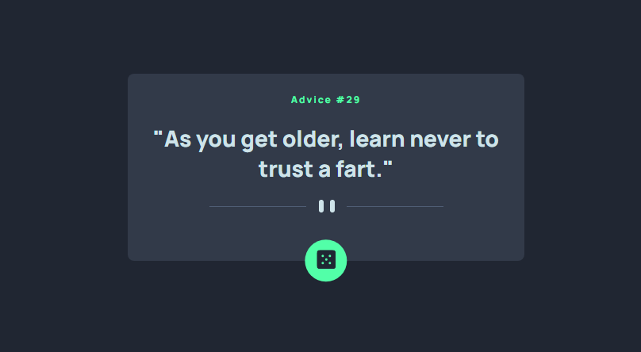

# Frontend Mentor - Advice generator app solution

This is a solution to the [Advice generator app challenge on Frontend Mentor](https://www.frontendmentor.io/challenges/advice-generator-app-QdUG-13db). Frontend Mentor challenges help you improve your coding skills by building realistic projects.

## Table of contents

- [Overview](#overview)
  - [The challenge](#the-challenge)
  - [Screenshot](#screenshot)
  - [Links](#links)
  - [Built with](#built-with)
  - [What I learned](#what-i-learned)

## Overview

### The challenge

Users should be able to:

- Click the dice button and receive a new advice
- Interactive elements

### Screenshot



### Links

- Live Site URL: [Preview Site](https://your-live-site-url.com)

### Built with

- Semantic HTML5 markup
- CSS custom properties
- Flexbox
- Mobile-first workflow

### What I learned

I learned what API's are and how to implement them in my code. I also learned more about .json files.
I also learned about the `async` and `await` keywords.

To see how you can add code snippets, see below:

```js
  const res = await fetch(API)
  const data = await res.json()
}
```

